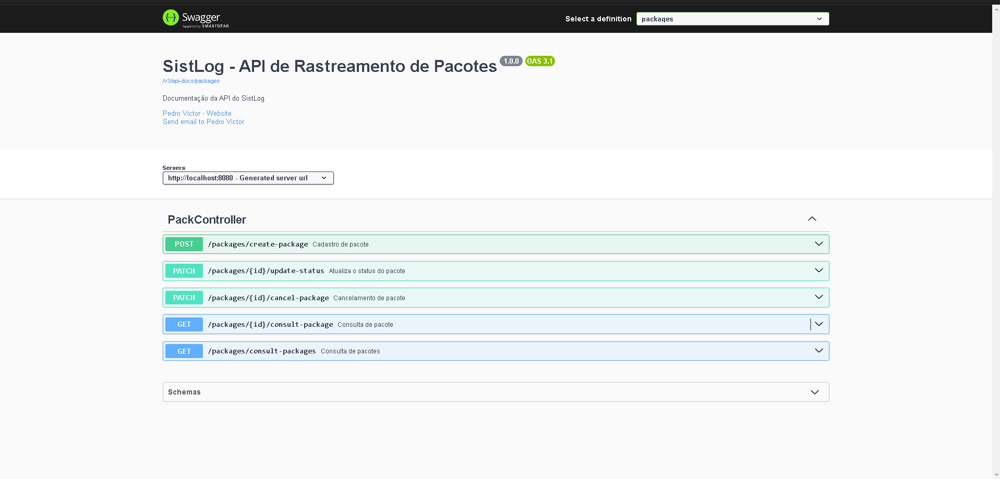

# Sist-Log

### 🚀 API para gerenciamento e rastreamento de pacotes em um sistema logístico, desenvolvida com Spring Boot e MySQL, rodando via Docker.

---

## 📚 Funcionalidades
- 📦 Cadastro de pacote -> Registra um novo pacote no sistema com estimativa de entrega.
- 🔄 Atualização de status -> Modifica o status do pacote (ex: enviado, em trânsito, entregue) e gera um **evento de rastreamento** correspondente.
- 🔍 Consulta de detalhes de pacote -> Recupera informações completas de um pacote específico, incluindo status atual e eventos de rastreamento.
- 📋 Consulta de lista de pacotes -> Consulta a lista de pacotes registrados no sistema sem contar com os eventos de rastreio.
- ❌ Cancelamento de pacote -> Permite cancelar um pacote caso ele ainda não tenha sido enviado para entrega.

---

## 🛠 Tecnologias Utilizadas
- ☕ Java 21 (Amazon Corretto)
- 🌱 Spring Boot 3.x
- 🗄️ MySQL 8.x
- ⚡ HikariCP 5.x (Pool de Conexões para melhor performance)
- 🐳 Docker & Docker Compose

---

## 🛠 Como rodar o projeto?
### Pré-requisitos
- Antes de rodar o projeto, certifique-se de ter instalado: 

    **✅ Docker e Docker Compose**


    🐧 Linux? → Instale o Docker e o Docker Compose separadamente através de comandos no terminal.

    🏁 Windows ou 🍏 Mac? → Instale o Docker Desktop, que já inclui o Docker Compose.
  
⚠ **Windows?** Certifique-se de ter o **WSL 2** configurado corretamente.

### ▶ Rodando o projeto
1. Clone o repositório em uma IDE de sua escolha
2. Acesse a pasta do projeto (raiz)
3. Adicione na raiz do projeto (dentro de sist-log) dois arquivos que se chamam: .env e .env.docker. Obs.: Caso você não possua os arquivos que enviei separadamente, terá que criar ambos arquivos colocando praticamente a mesma informação em ambos:
    ```
    .env:
     SPRING_APPLICATION_NAME=sist-log
     SPRING_DATASOURCE_URL=jdbc:mysql://mysql_sist_log:3306/sist_log?useSSL=false&allowPublicKeyRetrieval=true
     SPRING_DATASOURCE_USERNAME=root
     SPRING_DATASOURCE_PASSWORD=senha (coloque a senha que desejar)
   
    .env.docker:
      SPRING_APPLICATION_NAME=sist-log
      SPRING_DATASOURCE_URL=jdbc:mysql://mysql_sist_log:3306/sist_log?useSSL=false&allowPublicKeyRetrieval=true
      SPRING_DATASOURCE_USERNAME=root
      SPRING_DATASOURCE_PASSWORD=senha (coloque a senha que desejar)
   
   Obs.: Lembre-se, cada uma dessas informações fica no seu próprio arquivo.
    ```
3. Após isso, execute o comando `docker-compose up --build` para subir o container do MySQL e da aplicação
4. Acesse a URL `http://localhost:8080/swagger-ui.html` para acessar a documentação da API

---

## 🔎 Visualização prévia da API no Swagger


---

## 🛑 Como parar a execução do projeto?
### Execute o comando:
- `docker-compose down` na pasta raiz do projeto para remover o container criado.
</br>
<strong>OU</strong>
</br>
- `docker-compose down -v` para remover os volumes também além do próprio container.

---

## 🎯 Considerações Finais
- Desenvolvi o projeto com o intuito de demonstrar conhecimentos em Java, Spring Boot e Docker.
- Feedbacks agregariam e muito o meu desenvolvimento.

**Obrigado!**
```
